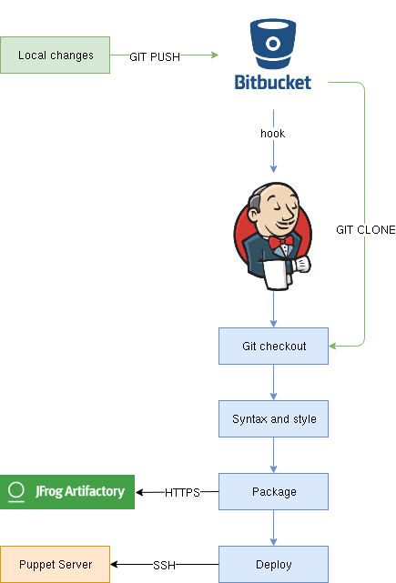

---?color=linear-gradient(90deg, black 50%, white 50%)
@snap[west span-50 text-white text-20]
Puppet Learning Course
@snapend
@snap[east span-35 text-10]
Thomas Cassaert

June 11, 2019
@snapend

---?image=assets/img/orange.jpg&position=top&size=100% 20%
@snap[north text-white span-100]
@size[1.5em](Overview)
@snapend

@snap[south span-100]
@ul
* Introduction
* Puppet Bolt
* What is Puppet?
* Basic Puppet structures
* Declarative code
* Agent - Server model
* Classes, manifests, modules
* Ordering
* Variables
@ulend
@snapend

+++?image=assets/img/orange.jpg&position=top&size=100% 20%
@snap[north text-white span-100]
@size[1.5em](Overview)
@snapend

@snap[south span-100]
@ul
* Templates
* Parameterizing
* Facter
* Basic programming structures
* Puppet Forge
* Roles and profiles
* Hiera
* Defined types
* Puppet at VITO
@ulend
@snapend

---?image=assets/img/orange.jpg&position=top&size=100% 20%
@snap[north text-white span-100]
@size[1.5em](Introduction)
@snapend

@ul

* Puppet learning VM
* Quests
* Learning with small steps
@ulend

---?image=assets/img/orange.jpg&position=top&size=100% 20%
@snap[north text-white span-100]
@size[1.5em](Puppet Bolt)
@snapend

@ul

* Remote code execution
* Masterless
* Any script or command
@ulend

---?image=assets/img/orange.jpg&position=top&size=100% 20%

@snap[north text-white span-100]
@size[1.5em](What is Puppet?)
@snapend

@ul
* Define desired state
* DSL
* Infrastructure as code
* Declarative
* Focus on what, not how
@ulend

---?image=assets/img/orange.jpg&position=top&size=100% 20%
@snap[north text-white span-100]
@size[1.5em](Basic Puppet structures)
@snapend

@ul
* Resource type
* Providers
@ulend

+++?image=assets/img/orange.jpg&position=top&size=100% 20%
@snap[north text-white span-100]
@size[1.5em](Resource type)
@snapend

@ul
* File
* Package
* Service
* User
* Group
* ...
@ulend

@snap[south text-black span-100]
[@fa[external-link] Puppet Resource Type Docs](https://puppet.com/docs/puppet/6.4/type.html)
@snapend

+++?image=assets/img/orange.jpg&position=top&size=100% 20%
@snap[north text-white span-100]
@size[1.5em](Provider)
@snapend

@ul
* One or more per Resource Type
* Yum, apt, gem, pip, ...
* Native system tool to get to desired state
@ulend

+++?code=assets/code_examples/declarative.pp&lang=puppet&color=#232323

@snap[north span-100]
@size[1.5em](Declarative code)
@snapend

@[1](Resource type and title)
@[2-3](Resource attributes)
@[3](Resource provider)
@[6](Resource type and title)
@[7-10](Resource attributes)

---?image=assets/img/orange.jpg&position=top&size=100% 20%

@snap[north text-white span-100]
@size[1.5em](The Puppet agent and server)
@snapend

@ul
* Client-server model
* Facter
* Catalog
* Client pulls from server
* Every 30 minutes
* Encrypted
@ulend

+++?image=assets/img/orange.jpg&position=top&size=100% 20%

@snap[north text-white span-100]
@size[1.5em](Node classification)
@snapend

@ul
* Catalog request from agent
* Node classification to check what Puppet code to compile
@ulend

+++?code=assets/code_examples/node_definition.pp&lang=puppet&color=#232323

@[1](Node identifier)
@[2-3](Resources to apply to matching hosts)

---?image=assets/img/orange.jpg&position=top&size=100% 20%

@snap[north text-white span-100]
@size[1.5em](Classes, manifests, modules)
@snapend

@ul
* Module consists of classes
* Classes are defined in manifests
* Modules get declared on node

+++?code=assets/code_examples/module_tree&color=#232323

@snap[north span-100]
@size[1.5em](Module layout)
@snapend

@[2-3](Module key-value parameters)
@[5-6](Module files)
@[8-9](All Puppet manifests)
@[12-13](Module templates)

+++?image=assets/img/orange.jpg&position=top&size=100% 20%
@snap[north text-white span-100]
@size[1.5em](Classes)
@snapend

@ul
* Combines a group of resources
  * package
  * service
  * files
@ulend

+++?code=assets/code_examples/class.pp&color=#232323

@snap[north span-100]
@size[1.5em](Example class)
@snapend

@[1](Class name)
@[2-4](Package resource)
@[6-9](Service resource)
@[10-13](File resource)

---?image=assets/img/orange.jpg&position=top&size=100% 20%
@snap[north text-white span-100]
@size[1.5em](Ordering)
@snapend

@ul
* Default random ordering
* Specificly defined
@ulend

+++?code=assets/code_examples/ordering.pp&color=#232323

@snap[north span-100]
@size[1.5em](Ordering example)
@snapend

@[7](Service requires package)

---?image=assets/img/orange.jpg&position=top&size=100% 20%

@snap[north text-white span-100]
@size[1.5em](Variables)
@snapend

@ul
* Prefixed with '$'
* Define before use
* Value cannot be reassiged
@ulend

---?image=assets/img/orange.jpg&position=top&size=100% 20%

@snap[north text-white span-100]
@size[1.5em](Templates)
@snapend

@ul
* Puppet native templating language
* ERB and EPP
* One file for many hosts
@ulend

+++?code=assets/code_examples/vhost.conf.erb&color=#232323&lang=puppet

@snap[north span-100]
@size[1.5em](Template example)
@snapend

@[1-2](Comment)
@[3](Templated port number)
@[6-8](Templated docroot)

+++?code=assets/code_examples/template_example.pp&color=#232323&lang=puppet

@snap[north span-100]
@size[1.5em](Template example)
@snapend

@[2-4](Class variables)
@[7-10](Template declaration)

---?image=assets/img/orange.jpg&position=top&size=100% 20%

@snap[north text-white span-100]
@size[1.5em](Parameterizing)
@snapend

@ul
* Reusable code
* Provide parameters, don't change modules
@ulend

+++?code=assets/code_examples/parameterized_class_declaration.pp&color=#232323&lang=puppet

@snap[north span-100]
@size[1.5em](Parameterized class)
@snapend

@[1](Node definition)
@[2-4](Parameterized class definition)
@[3](Override default docroot)

---?image=assets/img/orange.jpg&position=top&size=100% 20%

@snap[north text-white span-100]
@size[1.5em](Facter)
@snapend

@ul
* System properties
  * OS
  * Uptime
  * Environment
  * ...
* Facts available in manifests
@ulend

---?image=assets/img/orange.jpg&position=top&size=100% 20%

@snap[north text-white span-100]
@size[1.5em](Basic programming structures)
@snapend

@ul
* Conditionals
  * if/else
  * case
  * unless
* loops
  * each
@ulend

@snap[south span-100]
[@fa[external-link] Puppet Conditionals Docs](https://puppet.com/docs/puppet/6.4/lang_conditional.html)
@snapend

---?image=assets/img/orange.jpg&position=top&size=100% 20%

@snap[north text-white span-100]
@size[1.5em](Puppet Forge)
@snapend

@ul
* Puppet module repository
* Community modules
* Puppetlabs modules
@ulend

@snap[south]
[@fa[external-link] Puppet Forge](https://forge.puppet.com/)
@snapend

---?image=assets/img/orange.jpg&position=top&size=100% 20%

@snap[north text-white span-100]
@size[1.5em](Roles and profiles)
@snapend

@ul
* Pattern
* Profiles declare one or more classes
  * Set parameters
  * Combine classes
* Roles declare one or more profiles
  * Defines high-level function of system
@ulend

+++?code=assets/code_examples/profile_apache.pp&lang=puppet&color=#232323

@snap[north span-100]
@size[1.5em](Profile example)
@snapend

@[2-4](Profile parameters)
@[6-9](Apache class declaration)
@[11-13](PHP class declaration)

+++?code=assets/code_examples/webserver.pp&lang=puppet&color=#232323

@snap[north span-100]
@size[1.5em](Role example)
@snapend

@[2-3](Profiles declaration)

---?image=assets/img/orange.jpg&position=top&size=100% 20%
@snap[north text-white span-100]
@size[1.5em](Hiera)
@snapend

@ul
* Data-lookup system
* Remove data out of manifests
* Hierarchically
* Override defaults
* YAML
@ulend

+++?code=assets/code_examples/hiera.yaml&lang=yaml&color=#232323
@snap[north span-100]
@size[1.5em](Hiera hierarchy)
@snapend

@[2-4](Node parameters)
@[2, 5-6](Environment parameters)
@[2, 7-8](Global parameters)

+++?code=assets/code_examples/hiera_example.yaml&lang=puppet&color=#232323
@snap[north span-100]
@size[1.5em](Hiera example)
@snapend

---?image=assets/img/orange.jpg&position=top&size=100% 20%
@snap[north text-white span-100]
@size[1.5em](Singleton classes)
@snapend

@ul
* One instance of service
* One set of config files
* But...
  * What with multiple vhosts per server?
@ulend

---?image=assets/img/orange.jpg&position=top&size=100% 20%
@snap[north text-white span-100]
@size[1.5em](Defined types)
@snapend

@ul
* Repeatable group of resources
* Similar syntax to classes
* Not singleton
* But...
  * Every resource must have unique name
@ulend

+++?code=assets/code_examples/defined_type.pp&lang=puppet&color=#232323
@snap[north span-100]
@size[1.5em](Defined type example)
@snapend

@[1](Defined type)
@[2-3](Defined type parameters)
@[5-8](Declaration of apache::vhost defined type)
@[10-13](Firewall resource with unique name)

+++?code=assets/code_examples/defined_type_usage.pp&lang=puppet&color=#232323
@snap[north span-100]
@size[1.5em](Defined type example)
@snapend

@[1](Profile_apache::vhost class)
@[2-5](Defined type declaration vhost_1)
@[7-10](Defined type declaration vhost_2)
@[3-4,8-9](Different default overrides)

---?image=assets/img/orange.jpg&position=top&size=100% 20%
@snap[north text-white span-100]
@size[1.5em](Puppet at VITO)
@snapend

@snap[south]

@snapend

+++?code=assets/code_examples/puppet_tree&color=#232323
@snap[north span-100]
@size[1.5em](Puppet tree directory layout)
@snapend

@[6-7](Host manifests)
@[10-12](Internal and upstream modules)

+++?code=assets/code_examples/host_manifest.pp&lang=puppet&color=#232323
@snap[north span-100]
@size[1.5em](Host manifest)
@snapend

@[5-6](Hiera classes lookup)

+++?code=assets/code_examples/hiera_tree&color=#232323
@snap[north span-100]
@size[1.5em](Hiera tree directory layout)
@snapend

@[3](Global parameters)
@[7-9](mgmt_prod parameters)

---?image=assets/img/orange.jpg&position=top&size=100% 20%
@snap[north text-white span-100]
@size[1.5em](Puppet trees)
@snapend

@ul
* puppet-modules
* puppet-hadoop
* puppet-uservm
* puppet-mgmt
* puppet-resenv_generic
* All have multiple environments
@ulend

@snap[south text-black span-100]
[@fa[external-link] Puppet trees and environments](https://confluence.vito.be/display/EP/Puppet)
@snapend

---?image=assets/img/orange.jpg&position=top&size=100% 20%
@snap[north text-white span-100]
@size[1.5em](Git submodules)
@snapend

@ul
* Reusable
* Modular
* Git history of external component
* Community backed
@ulend

+++?image=assets/img/orange.jpg&position=top&size=100% 20%
@snap[north text-white span-100]
@size[1.5em](Internal and upstream modules)
@snapend

@ul
* Internal
  * Developed at VITO
  * Profiles
  * Roles
* Upstream
  * Forge
  * Github
@ulend

---?image=assets/img/orange.jpg&position=top&size=100% 20%
@snap[north text-white span-100]
@size[1.5em](Jenkins)
@snapend

@ul
* Automated builds
* Syntax and style checking
* Packaging
* Deploying
@ulend

---?image=assets/img/orange.jpg&position=top&size=100% 20%
@snap[north text-white span-100]
@size[1.5em](Foreman)
@snapend

@ul
* Host inventory
* Puppet reporting
@ulend
